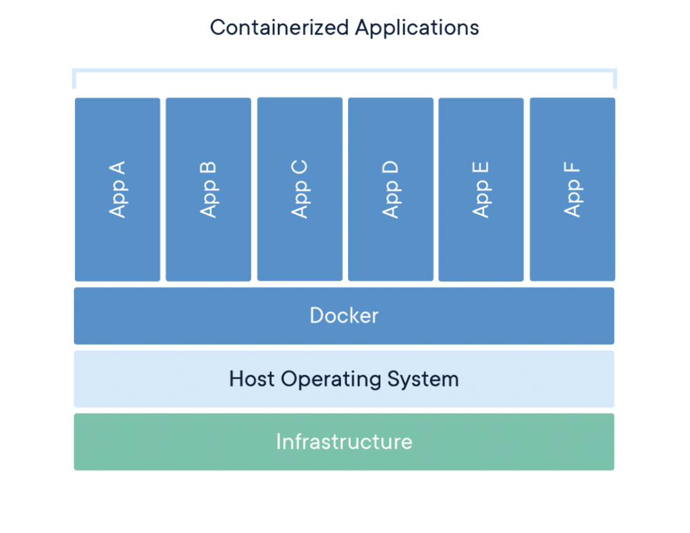
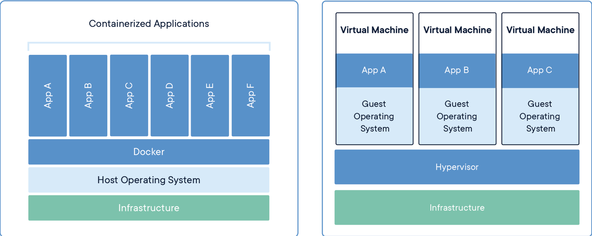

## Docker Overview
Docker container technology was launched in 2013 as an open source [Docker Engine](https://www.docker.com/products/container-runtime/)(Container Runtime). It is a universal packaging approach that bundles up all application dependencies inside a container which is then run on Docker Engine.
- **Powered by containerd:** Built on the leading open source container runtime, a graduated project of the Cloud Native Computing Foundation (CNCF). Containerd implements Kubernetes Container Runtime Interface (CRI) and is widely adopted across public clouds and enterprises. Docker developed a Linux container technology – one that is portable, flexible and easy to deploy. Docker open sourced libcontainer and partnered with a worldwide community of contributors to further its development. In June 2015, Docker donated the container image specification and runtime code now known as runc, to the Open Container Initiative (OCI) to help establish standardization as the container ecosystem grows and matures. Following this evolution, Docker continues to give back with the containerd project, which Docker donated to the Cloud Native Computing Foundation (CNCF) in 2017. containerd is an industry-standard container runtime that leverages runc and was created with an emphasis on simplicity, robustness and portability. containerd is the core container runtime of the Docker Engine.
- **Integrated BuildKit:** BuildKit is an open source tool that takes the instructions from a Dockerfile and ‘builds” a Docker image. This process can take a long time so BuildKit provides several architectural enhancements that makes it much faster, more precise and portable.
- **Docker CLI:** The most popular way to interface with Docker containers is the Docker CLI – a simple, yet powerful client that greatly simplifies how you manage container instances through a clear set of commands.

## Container Vs Virtual Machines
Containers and virtual machines have similar resource isolation and allocation benefits, but function differently because containers virtualize the operating system instead of hardware. Containers are more portable and efficient.
- **Containers:** Containers are an abstraction at the app layer that packages code and dependencies together. Multiple containers can run on the same machine and share the OS kernel with other containers, each running as isolated processes in user space. Containers take up less space than VMs (container images are typically tens of MBs in size), can handle more applications and require fewer VMs and Operating systems.
- **Virtual Machines:** Virtual machines (VMs) are an abstraction of physical hardware turning one server into many servers. The hypervisor allows multiple VMs to run on a single machine. Each VM includes a full copy of an operating system, the application, necessary binaries and libraries – taking up tens of GBs. VMs can also be slow to boot.

