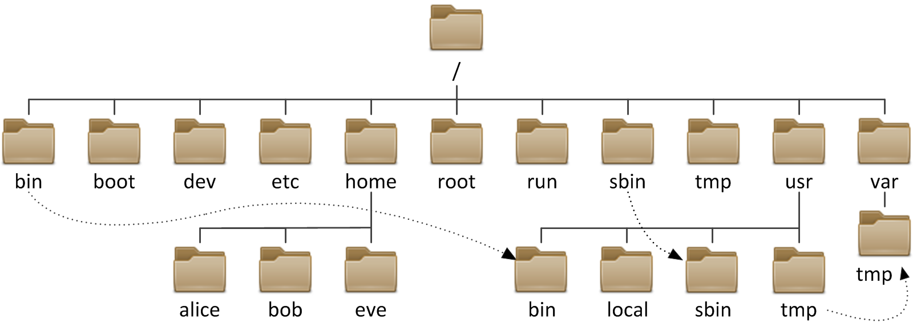

## What is Linux Filesystem hierarchy?
The Linux file system hierarchy follows a standard directory structure. The key directories include /bin, /sbin, /proc, /etc, /home, /root, /usr, /var, and /tmp. Each directory serves a specific purpose, such as storing executable binaries (/bin), configuration files (/etc), user home directories (/home - it's default base directory for non root users), and variable data like logs (/var) and temporary files (/tmp).

