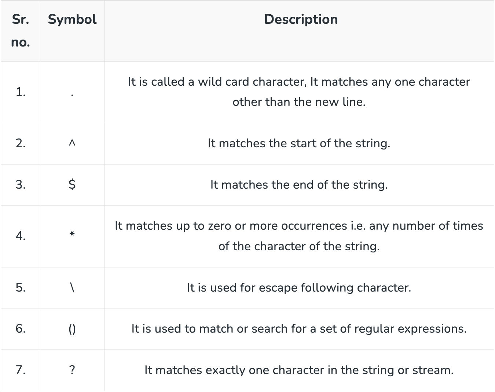

## Regular Expressions(Regex)
- Regular expressions (regex or regexp) in Linux are powerful patterns that define text strings. They are widely used in commands and utilities for searching, matching, and manipulating text. 
- Regular expressions are special characters or sets of characters that help us to search for data and match the complex pattern.

#### Examples
- **Basic Search:**
  - **`grep 'pattern' filename`**                       ## Searches for the pattern in a file
- **Wildcard Characters:**
  - **`.`**                                             ## Matches any single character
  - **`.*`**                                            ## Matches any sequence of characters
- **Character Classes:**
  - **`[0-9]`**                                         ## Matches any digit
  - **`[a-zA-Z]`**                                      ## Matches any uppercase or lowercase letter
  - **`[^0-9]`**                                        ## Matches any non-digit
- **Anchors:**
  - **`^pattern`**                                      ## Matches lines that start with the pattern
  - **`pattern$`**                                      ## Matches lines that end with the pattern
- **Quantifiers:**
  - **`a*`**                                            ## Matches 'a', 'aa', 'aaa', etc
  - **`a+`**                                            ## Matches 'a', 'aa', 'aaa', etc., but not an empty string
  - **`a?`**                                            ## Matches 'a' or an empty string
- **Escape Characters:**
  - **`\.`**                                            ## Matches a literal period

#### Utilities Using Regular Expressions
- **grep:**
  - Searches for patterns in files
  - Example: **`grep 'pattern' file.txt`**
- **sed:**
  - Stream editor for filtering and transforming text
  - Example: **`sed 's/old/new/' file.txt`**
- **awk:**
  - Text processing tool with powerful pattern matching
  - Example: **`awk '/pattern/ {print $1}' file.txt`**
- **find:**
  - Searches for files in a directory hierarchy
  - Example: **`find . -name '*.txt'`**
- **egrep or grep -E:**
  - Supports extended regular expressions with additional metacharacters
  - Example: **`egrep 'pattern1|pattern2' file.txt`**
- **vi and vim:**
  - Text editors that support regex for searching and text manipulation
